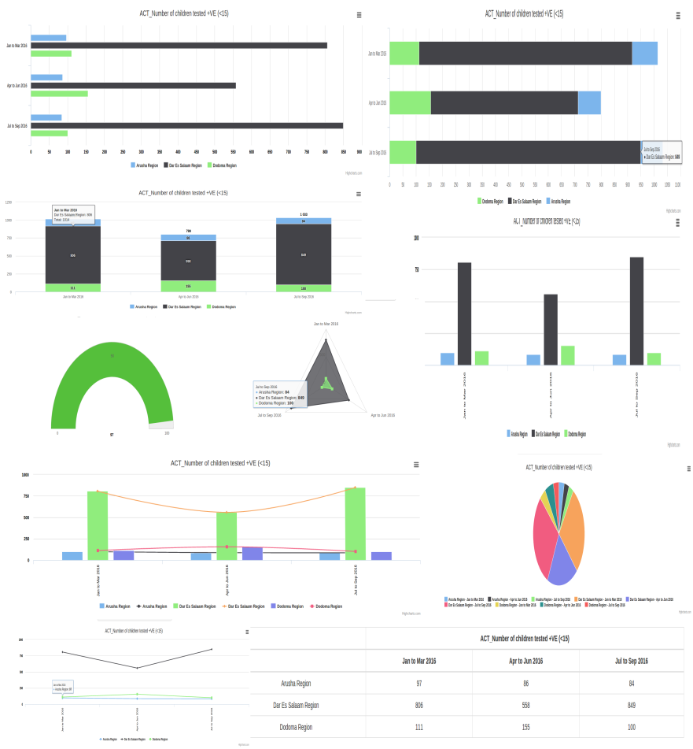

# ng2-dhis-visualizer
Data Visualization service in DHIS2 using angular 2

## Installation
This component assumes that the angular app is created using [angular cli](https://cli.angular.io/).
To use this component download it from git [here](https://github.com/hisptz/ng2-dhis-visualizer), You need just a single file visulizer.service.ts.
 
### Dependencies
This component uses [highchart library](http://www.highcharts.com/)  and a nice angular 2 wraper for Highcharts from 
[https://github.com/gevgeny/angular2-highcharts](https://github.com/gevgeny/angular2-highcharts). To install it just type

```shell
npm install angular2-highcharts --save 

npm install highcharts --save
```

If you want to enjoy some additional features like export, and polar charts then 
update angular-cli.json script section :

```javascript
   "scripts": [
     "../node_modules/highcharts/highcharts.js",
     "../node_modules/highcharts/highcharts-more.js",
     "../node_modules/highcharts/modules/exporting.js",
     "../node_modules/highcharts/modules/offline-exporting.js",
     "../node_modules/highcharts/modules/solid-gauge.js"
     ]
```
     
You will need to use the service from a file visulizer.service.ts, save it anywhere in your project file
and include it in the app.module as follows, Import chartsModule from the above mentioned library and 
visulizer service, then make sure that you add VisulizerService in the list of 
providers

```javascript
import { BrowserModule } from '@angular/platform-browser';
import { NgModule } from '@angular/core';
import { FormsModule } from '@angular/forms';
import { HttpModule } from '@angular/http';

import { AppComponent } from './app.component';
import {ChartModule} from "angular2-highcharts";
import {VisulizerService} from "./view/ng2-dhis-visualizer/visulizer.service";

@NgModule({
  declarations: [
    AppComponent
  ],
  imports: [
    BrowserModule,
    FormsModule,
    HttpModule,
    ChartModule
  ],
  providers: [VisulizerService],
  bootstrap: [AppComponent]
})
export class AppModule { }

```

You can see that I have added the ChartModule in the import part of @ngModule and Visulizer service
 on the providers list.

In any of your components where you want to use as follows:
###HTML Template
```html
<div [ng2-highcharts]="chartData" class="graph"></div>
```
In your component class you will need to provide for the chartData object, We will use
the VisulizerService to perform that.

**_Inject the visulizerService in component constructor_**
 
 ```javascript
 constructor(private visulizationService: VisulizerService) {   }
 ```
**_Define the visulization configuration object_**

```javascript
visualizer_config = {
        'type': 'chart',
        'chartConfiguration': {
          'type':type,
          'title': this.prepareCardTitle(this.indicator),
          'xAxisType': 'pe',
          'yAxisType': 'ou'
        }
      }
```
#### [type]
This is the type of visualization that you want, it can be either [chart] or [table]
#### [chartConfiguration.type]
This is the chart type it may be either
* bar
* column
* line
* combined
* area
* pie
* radar
* stacked bar
* stacked column
* gauge

#### [chartConfiguration.title]
This will be used as a chart title
#### [chartConfiguration.xAxisType]
This represents what can stay in xAxis
* ou - for organisation units
* pe - for periods
* dx - for data( data elements, indicators or datasets )
* co - for category combinations
* You can also pass uid of a data dimension like age, gender etc

#### [chartConfiguration.yAxisType]
This represents what can stay in yAxis the options are similar to what we see for
chartConfiguration.xAxisType

**_now use the service to define the chartData object_**
```javascript
this.chartData = this.visulizationService.drawChart( analyticsData, visualizer_config.chartConfiguration );
```
#### [analyticsData]
This is expected to be a standard json result from DHIS analytics call, see the example bellow. Any valid analytics data result will work with this component.

```html
api/analytics.json?dimension=dx:dataElemets&dimension=pe:periods&filter=ou:orgUnits&displayProperty=NAME
```

## Table
To draw a table just change the visualizer config to look like follows
```javascript
visualizer_config = {
    'type': 'table',
    'tableConfiguration': {
        'rows': ['ou', 'dx', 'pe', 'IymWT9V0HZI'] ,
        'columns': ['co', 'VG4aAdXA4JI']
    }
};
```

**_stableConfiguration.rows:_**

        Items to be shown in a row, options are similar to what xAxisItem in chart configuration object
        
**_tableConfiguration.columns:_**

        items to be showm in a column, same options as above 
       
To see the table we can use the service to generate table object as follows:
```javascript
this.tableData = this.visulizationService.drawChart( analyticsData, visualizer_config.tableConfiguration );
```
You will need the following html codes for drawing the table:

```html
<table class="table table-bordered">
    <thead>
    <tr *ngFor="let header of tableData.headers">
      <th *ngFor="let table_column of tableData.columns"></th>
      <th *ngFor="let header_column of header.items" [colSpan]="header_column.span" style="text-align: center">
        {{ header_column.name }}
      </th>
    </tr>
    </thead>
    <tbody>
    <tr *ngFor="let row of tableData.rows">
      <td *ngFor="let header_column of row.items" style="text-align: center;vertical-align: middle" [attr.rowspan]="header_column.row_span">
        {{ header_column.val }}
      </td>
    </tr>
    </tbody>
  </table>
```
some sample result from analytics call that comes with the following headers
```javascript
"headers": [
             {
               "name": "dx",
               "column": "Data",
               "type": "java.lang.String",
               "hidden": false,
               "meta": true
             },
             {
               "name": "ou",
               "column": "Organisation unit",
               "type": "java.lang.String",
               "hidden": false,
               "meta": true
             },
             {
               "name": "pe",
               "column": "Period",
               "type": "java.lang.String",
               "hidden": false,
               "meta": true
             },
             {
               "name": "value",
               "column": "Value",
               "type": "java.lang.Double",
               "hidden": false,
               "meta": false
             }
           ]
```


### Thinking about the future:
        *Exposing charts events like click/hover at the points
        *allowing setting of table legend
        *Header and row styling of tables
        *Table sorting functionality

**Author: Kelvin Mbwilo <Kelvinmbwilo@gmial.com>**

